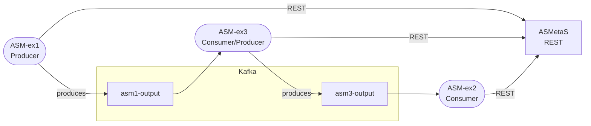

# Kafka‑DigitalTwins – Specifica Software  
> **Versione**: 2025-07-09  
> **Stato**: *Release Candidate* – verificata e pronta alla consegna  

---

## Indice
1. [Introduzione](#1-introduzione)  
2. [Architettura di Sistema](#2-architettura-di-sistema)  
3. [Componenti](#3-componenti)  
   3.1 [Kafka Cluster](#31-kafka-cluster)  
   3.2 [Simulatore ASMetaS](#32-simulatore-asmetas)  
   3.3 [Modulo ASM‑ex1](#33-modulo-asm-ex1)  
   3.4 [Modulo ASM‑ex3](#34-modulo-asm-ex3)  
   3.5 [Modulo ASM‑ex2](#35-modulo-asm-ex2)  
   3.6 [Shared Modules](#36-shared-modules)  
4. [Flusso dei Dati](#4-flusso-dei-dati)  
5. [Installazione & Avvio](#5-installazione--avvio)  
6. [Configurazione](#6-configurazione)  
7. [Estendere la Pipeline](#7-estendere-la-pipeline)  
8. [Troubleshooting](#8-troubleshooting)  
9. [Struttura del Repository](#9-struttura-del-repository)  
10. [Riferimenti](#10-riferimenti)  

---

## 1. Introduzione
Questo progetto implementa una **pipeline di validazione distribuita** basata su **Apache Kafka** e sul **simulatore REST ASMetaS** per Abstract State Machines (ASM).  
Ogni nodo riceve eventi da Kafka, li invia al simulatore, riceve la risposta e, se previsto, la pubblica su un topic di uscita, consentendo l’orchestrazione di più modelli ASM in catena.

## 2. Architettura di Sistema


### 2.1 Vista d’insieme
- **Kafka Cluster**: backbone di messaggistica a bassa latenza.  
- **Contenitori ASM‑ex\***: wrapper Python che consumano/producono eventi (a seconda del ruolo) e invocano **ASMetaS**.  
- **ASMetaS Server**: servizio Java che offre endpoint `POST /asm`, `PUT /asm/next`, `DELETE /asm` per avviare, far evolvere e terminare una simulazione.

## 3. Componenti

### 3.1 Kafka Cluster
Contenitore `kafka` (con ZooKeeper incorporato) definito in **docker-compose.yml**.  
Topic pre‑creati: `asm1-output`, `asm3-output`.

### 3.2 Simulatore ASMetaS
Container Java basato sul repo *ASMetaS-web-service*. Espone:
| Metodo | Endpoint | Funzione |
|--------|----------|----------|
| `POST` | `/asm` | Carica modello ASM e stato iniziale |
| `PUT`  | `/asm/next` | Avanza di un passo e restituisce nuova configurazione |
| `DELETE` | `/asm` | Termina la simulazione |

### 3.3 Modulo ASM‑ex1
- **Ruolo**: **Producer** che genera i messaggi iniziali della pipeline.  
- **Topic OUT**: `asm1-output`  
- **Modello ASM**: `inc-dec-multi.asm`  

### 3.4 Modulo ASM‑ex3
- **Ruolo**: consumer intermedio e nuovo producer.  
- **Topic IN**: `asm1-output`   **Topic OUT**: `asm3-output`  
- **Modello ASM**: `traffic-light.asm`  

### 3.5 Modulo ASM‑ex2
- **Ruolo**: consumer finale che registra l’esito o persiste in DB.  
- **Topic IN**: `asm3-output`  
- **Modello ASM**: `inc-dec-single.asm`  

### 3.6 Shared Modules
Funzioni riutilizzabili in `shared_modules/`:
- `kafka_utils.py`: produttore/consumatore generici.
- `asmeta_client.py`: wrapper REST con gestione errori e retry.
- `logging_conf.py`: configurazione logging uniforme.

## 4. Flusso dei Dati
1. **ASM‑ex1** crea evento E₀ → lo invia ad ASMetaS.  
2. Risposta R₁ pubblicata su `asm1-output`.  
3. **ASM‑ex3** legge R₁, invia a ASMetaS, produce R₂ su `asm3-output`.  
4. **ASM‑ex2** consuma R₂, lo valida/archivia.  
5. Eventuali errori di rete ⇒ retry con back‑off esponenziale.

## 5. Installazione & Avvio
```bash
# Clona il repo
git clone https://github.com/DaniGreco/Kafka-DigitalTwins.git
cd Kafka-DigitalTwins

# Avvio completo (build + up)
docker-compose up --build
```
Visita <http://localhost:5000/swagger-ui/> per testare gli endpoint ASMetaS.

## 6. Configurazione
Ogni modulo possiede `config.json`:
```json
{
  "kafka": {
    "bootstrap_servers": "kafka:9092",
    "topic_in": "asm1-output",
    "topic_out": "asm3-output"
  },
  "asmetas": {
    "host": "asmetas",
    "port": 8080,
    "model": "traffic-light.asm"
  }
}
```
Modifica i percorsi ai modelli ASM per sperimentazioni diverse.

## 7. Estendere la Pipeline
- **Aggiungere un modulo**: copia `ASM-ex_template`, imposta nuovi topic e modello.  
- **Cambiare broker**: sostituisci `kafka` con `Redpanda` mantenendo le stesse API.  
- **Persistenza**: collega `ASM-ex2` a PostgreSQL o MongoDB.

## 8. Troubleshooting
| Sintomo | Possibile causa | Rimedio rapido |
|---------|-----------------|----------------|
| `ConnectionError` verso ASMetaS | Server non in esecuzione o porta errata | `docker-compose ps`; riavvia container `asmetas` |
| Crash ASMetaS con `ConcurrentModificationException` | Bug interno al simulatore | `docker restart asmetas`; apri issue nel repo ASMetaS |
| Loop infinito su consumer | Offset non committato | Cancella gruppo: `kafka-consumer-groups --bootstrap-server kafka:9092 --delete --group asm3` |

## 9. Struttura del Repository
```
Kafka-DigitalTwins/
├── ASM-ex1/                # Nodo producer
│   ├── main.py
│   ├── enforcer.py
│   └── config.json
├── ASM-ex2/                # Nodo consumer finale
├── ASM-ex3/                # Nodo consumer+producer
├── shared_modules/         # Utility comuni
├── docker-compose.yml
└── web_documentation/
    ├── mkdocs.yml
    └── docs/
        └── index.md        # <— questo file
```

## 10. Riferimenti
1. **Apache Kafka – Documentation**  
   <https://kafka.apache.org/documentation>  
2. **ASMetaS‑web‑service (Foselab)**  
   <https://github.com/foselab/ASmetaS-web-service>  
3. **Kafka‑DigitalTwins – Repository di progetto**  
   <https://github.com/DaniGreco/Kafka-DigitalTwins>
